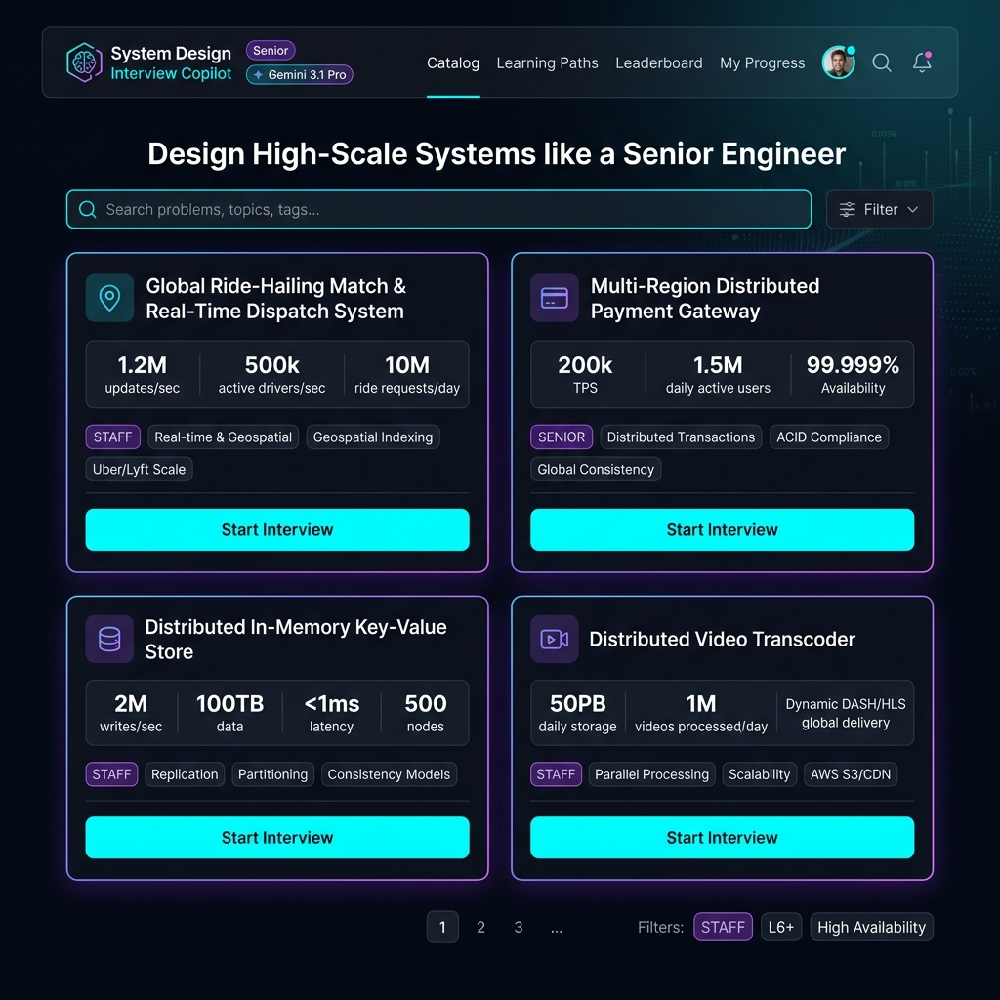
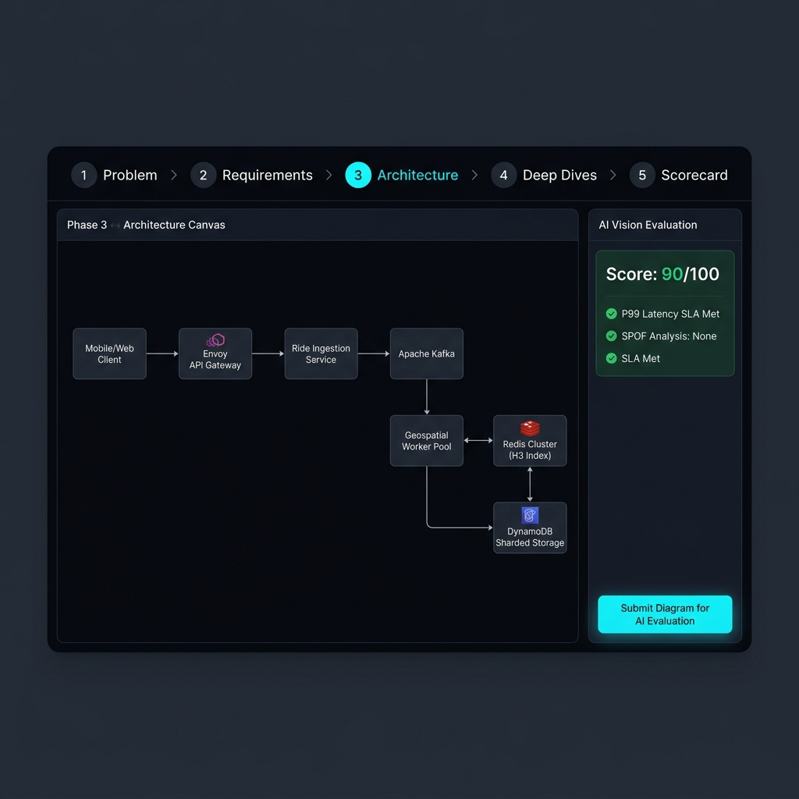
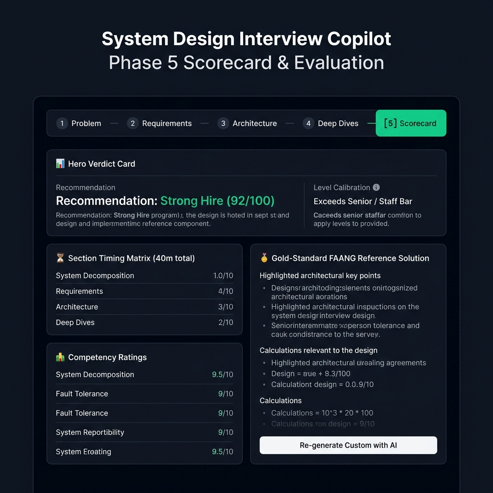
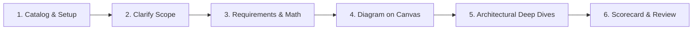

<div align="center">

# 🧠 System Design Interview Copilot
### AI-Powered Mock Interview Studio & Stage-by-Stage Evaluation Engine
**Manifest V3 Chrome Extension • 100% Client-Side Privacy (BYOK) • Open Source**

[](LICENSE)
[](manifest.json)
[-emerald.svg)](tests/)
[](app/js/services/llm.js)
[](app/views/)

<p align="center">
  <b>Simulate, diagram, and master Senior, Staff, and Principal System Design interviews with real-time AI feedback, interactive canvas diagramming, and FAANG rubric evaluation.</b>
</p>

</div>

---

## 📸 Screenshots & Visual Tour

<div align="center">

### 1. Curated Problem Catalog & Scale Breakdown


*Browse 10+ Tier-1 problems with QPS, storage, and SLA requirements, or generate custom AI design scenarios.*

<br/>

### 2. Phase 3: Interactive Architecture Canvas & Vision AI Evaluation


*Drag-and-drop microservices, message streams, caches, and sharded DBs with instant visual topology grading.*

<br/>

### 3. Phase 5: FAANG Calibrated Scorecard & Reference Solution


*Receive weighted hiring recommendations, section timing breakdowns, and production-grade gold-standard architectures.*

</div>

---

## 🌟 Why System Design Interview Copilot?

Traditional system design preparation relies on static video courses or passive reading. In real interviews, candidates are evaluated on:
1. **Scope Clarification & Boundary Negotiation**
2. **Back-of-the-Envelope Calculations (QPS, Storage, Memory)**
3. **High-Level Diagramming & Component Interaction**
4. **Resilience Under Pressure (Failure Modes, Bottlenecks, Distributed Consensus)**
5. **Trade-Off Justifications Against FAANG Calibrated Bars**

**System Design Interview Copilot** transforms preparation into an active, timed, multi-phase technical simulation with a live AI interviewer that grades your architecture diagram, challenges your edge cases, and provides instant FAANG gold-standard benchmarks.

---

## 📖 How to Use (Step-by-Step Guide)



### 1. Choose or Generate a Problem (Catalog)
- Open the extension studio tab.
- Click **Settings** (⚙️) to enter your **Google Gemini** or **OpenAI API Key** (BYOK model).
- Select your **Target Level** (Mid-Level, Senior, Staff, Principal) and **Critique Strictness** (*Standard FAANG Bar*, *Hardcore / Principal Bar*, or *Constructive*).
- Pick from curated problems (e.g. *Global Ride-Hailing Match*, *Payment Gateway*, *Video Streaming Pipeline*) or click **"Create Custom Problem"** / **"Generate AI Problems"**.

### 2. Phase 1: Problem Scope & Clarification
- Read the interviewer's initial brief.
- Ask clarifying questions regarding read/write ratios, latency tolerances (p99), geographic distribution, and data consistency models.
- The AI interviewer provides realistic answers, hidden constraints, and trade-off cues.

### 3. Phase 2: Requirements & Back-of-the-Envelope Estimation
- Formalize your **Functional Requirements** (core user workflows) and **Non-Functional Requirements** (availability SLAs, consistency, durability).
- Use the **Estimation Workspace** to compute Peak QPS, Daily Storage Ingestion, and 80/20 Cache RAM requirements.
- Click **"Evaluate Requirements"** to receive instant AI scoring before moving forward.

### 4. Phase 3: High-Level Architecture Diagramming
- Use the interactive canvas toolbar to add components: *Client, API Gateway, Load Balancer, Microservice, Kafka/Stream, Redis/Cache, PostgreSQL, DynamoDB, Object Storage*.
- Connect components with directional arrows to illustrate request/response and asynchronous data pipelines.
- Click **"Submit Diagram for AI Vision Evaluation"**: The AI vision engine analyzes your diagram layout, checks for single points of failure (SPOFs), evaluates component decoupling, and highlights gaps.

### 5. Phase 4: Architectural Deep Dives
- Click **"Generate Deep Dives"** to receive technical challenge questions tailored specifically to the architecture you drew in Phase 3.
- Answer targeted scenarios on:
  - Cache stampede prevention and distributed locking
  - Multi-region replication lag and conflict resolution (CRDTs / Vector Clocks)
  - Horizontal partition rebalancing and hot-shard mitigation
- Click **"Evaluate Deep Dives"** to score your responses.

### 6. Phase 5: Final Review Scorecard & Gold-Standard Solutions
- View your **Overall Verdict** (`Strong Hire`, `Hire`, `Lean Hire`, `No Hire`) and total score (out of 100).
- Inspect your **Timed Matrix** across all phases to check if you stayed within real interview timing limits (e.g. 45 mins total).
- Study the **FAANG Gold-Standard Reference Blueprint** (stored automatically with your session).
- Need a fresh AI blueprint? Click **"✨ Re-generate Custom with AI"**.
- Click **"Export as PDF"** to save your full interview transcript and scorecard.

---

## ⚡ Key Highlights & Architecture

- **Bring Your Own Key (BYOK)**: Native support for Google Gemini (`gemini-3.1-pro-preview`, `gemini-2.5-flash`, `gemini-3.5-flash-lite`, custom IDs) and OpenAI (`gpt-5`, `gpt-4o`, `o3-mini`, custom IDs).
- **Zero Server Overhead**: 100% client-side Chrome Extension (Manifest V3) running on vanilla JavaScript and modular view templates.
- **Interviewer Critique Rigor Selector**:
  - `Standard FAANG Bar`: Realistic Google/Meta L5/L6 evaluation.
  - `Hardcore / Principal Bar`: Zero hand-waving, strict failure mode scrutiny.
  - `Constructive & Encouraging`: Growth-oriented guidance highlighting strengths.
- **Monotonic Progress Tracking**: Navigate freely between earlier and later tabs during or after an interview without losing progress.
- **Resilient Offline / Error Handling**: No fake mock scores; clean retry actions and connection guidance on API outages.

---

## 📂 Project Structure

```
system-design-evaluation/
├── manifest.json              # Chrome Extension Manifest V3 configuration
├── LICENSE                    # Open Source MIT License
├── README.md                  # Project overview & documentation
├── PRIVACY_POLICY.md          # Chrome Web Store compliant privacy policy
├── STORE_LISTING.md           # Chrome Web Store listing metadata & justifications
├── docs/
│   └── screenshots/           # UI screenshots (Catalog, Canvas, Scorecard)
├── background/
│   └── service-worker.js      # Background service worker & tab lifecycle manager
├── popup/
│   ├── popup.html             # Quick action popup launcher
│   ├── popup.js               # Session status & model indicator
│   └── popup.css              # Popup styling
├── icons/                     # Extension icons (16px, 48px, 128px)
├── app/
│   ├── index.html             # Main application shell
│   ├── css/                   # Variables, layout, and component styles
│   ├── js/
│   │   ├── app.js             # Main orchestrator & stage router
│   │   ├── canvas/            # Canvas diagram engine & shapes
│   │   ├── controllers/       # Stage controllers (discovery, clarification, reqs, hld, deepdive, scorecard)
│   │   └── services/          # LLM, prompts, problem engine, storage, template loader
│   └── views/                 # Modular HTML stage templates
├── prompts/                   # System prompt markdown templates
├── scripts/
│   └── package_extension.js   # Automated packaging script & secret scanner
└── tests/                     # 7 Automated test suites (100% passing)
```

---

## 🚀 Installation & Setup

### Option 1: Load Locally in Google Chrome (Developer Mode)

1. Clone this repository:
   ```bash
   git clone https://github.com/mchimankar/system-design-evaluation.git
   cd system-design-evaluation
   ```
2. Open Google Chrome and navigate to `chrome://extensions`.
3. Toggle **Developer mode** to **ON** (top right).
4. Click **Load unpacked** (top left) and select the project directory.
5. Click the **System Design Copilot** icon in your Chrome toolbar to launch the studio!

---

### Option 2: Build Production Package (ZIP)

Run the packaging script to validate assets, run the zero-key security scanner, and bundle the distribution archive:

```bash
node scripts/package_extension.js
```

Output:
```
📂 dist/system-design-copilot-v1.0.0.zip
```

---

## 🧪 Testing

The repository contains 7 automated test suites verifying modular templates, prompt loading, error resilience, model sanitization, responsive UI, monotonic navigation, and end-to-end simulation:

```bash
node tests/run_all_tests.js
```

---

## 🔒 Privacy & Security

- **No Remote Servers**: Your candidate responses, diagrams, notes, and API keys are stored exclusively in your browser's private `chrome.storage.local`.
- **Direct HTTPS**: Network requests are made directly from your browser to Google Generative Language or OpenAI endpoints.
- **Zero Telemetry**: No third-party analytics or user tracking.

---

## 📄 License

This project is licensed under the **MIT License** — see the [LICENSE](LICENSE) file for details.

---

## 👨‍💻 Author & Credits

- **Author & Creator**: **Mangesh Chimankar**
- **Contributions**: Pull requests, feature suggestions, and problem submissions are welcome!
